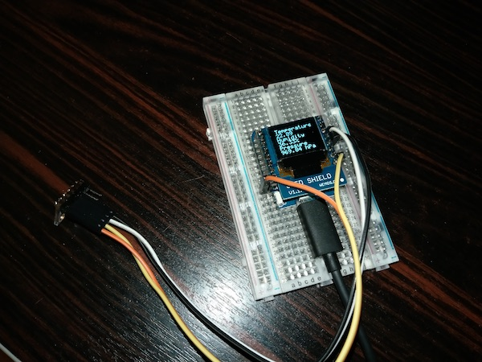

# wemos-weather-simple 
Simple Weather Station

## Configuration

- in ``src`` folder copy ``secrets_template.h`` to ``secrets.h`` and fill your own
  - Blynk API Token
  - AdafruitIO login
  - WiFi SSID and Password
  - MQTT server, username and password
- in ``src`` folder update ``config.h``
  - comment/uncomment ``define``/``undefine`` to select integrations (Blynk, AdafruitIO) 
  
- ``pio run``

## MQTT

Currently, topics published from SWS to Mosquitto MQTT server are stored in InfluxDB 
and shown on Grafana dashboard. Thus the payload of the topic is in form of Influx Data Line:

``key field=value``

Integration between Mosquitto and InfluxDB is over Telegraf.

Currently published topics are
- ``sensors/sws1/temperature``
- ``sensors/sws1/humidity``
- ``sensors/sws1/pressure``

## Libraries

- Adafruit GFX Library
  - pio id #13
  - (https://platformio.org/lib/show/13/Adafruit%20GFX%20Library)
- Adafruit SSD1306
  - pio id #135
  - (https://platformio.org/lib/show/135/Adafruit%20SSD1306)
- BME280
  - pio id #901
  - (https://platformio.org/lib/show/901/BME280)
- SSD1306Ascii
  - pio id #5169
  - (https://platformio.org/lib/show/5169/SSD1306Ascii)
- Blynk
  - pio id #415
  - (https://platformio.org/lib/show/415/Blynk)
- Adafruit MQTT Library
  - pio id #1092
  - (https://platformio.org/lib/show/1092/Adafruit%20MQTT%20Library)  
- Arduino Http Client
  - pio id #798
  - (https://platformio.org/lib/show/798/ArduinoHttpClient)  
- ArduinoJson
  - pio id #64
  - (https://platformio.org/lib/show/64/ArduinoJson)  
- PubSubClient
  - pio #89
  - (https://platformio.org/lib/show/89/PubSubClient)  
 - TroykaMQ (MQ135 support)
  - pio #2537
  - https://platformio.org/lib/show/2537/TroykaMQ